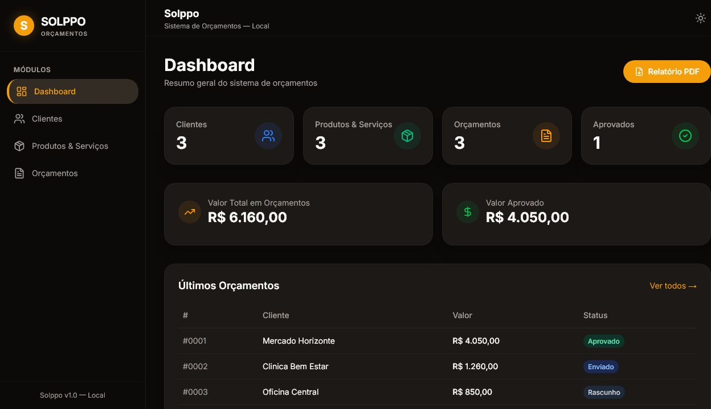

# SOLPPE Gestão de Orçamentos

Sistema local para organizar clientes, produtos, serviços e propostas comerciais da **SOLPPE — Solução Parceira Para Empresas**.

O projeto transforma um processo operacional disperso em um fluxo único: cadastrar o cliente, montar o orçamento, acompanhar seu status, gerar o PDF e encaminhá-lo pelo WhatsApp.



## Principais recursos

- Dashboard com clientes, orçamentos, aprovações e valor aprovado.
- Cadastro e edição de clientes, produtos e serviços.
- Orçamentos com itens, quantidades, descontos e validade.
- Fluxo de status: rascunho, enviado, aprovado e rejeitado.
- Geração de propostas e relatórios em PDF.
- Envio de orçamentos por WhatsApp por meio de integração configurável.
- Persistência local em SQLite com integridade referencial.
- Execução local ou em container Docker.

## Tecnologias

- Next.js 16 e React 19
- TypeScript
- SQLite com `better-sqlite3`
- jsPDF
- Tailwind CSS
- Docker

## Arquitetura

```text
solppo/
├── src/app/          # Telas e rotas da aplicação
├── src/components/   # Componentes de interface
├── src/lib/db/       # Schema e operações SQLite
├── src/lib/pdf.ts    # Geração de documentos
├── public/           # Recursos estáticos
└── Dockerfile
```

## Execução local

```bash
cd solppo
npm install
copy .env.example .env.local
npm run dev
```

Acesse `http://localhost:3000`.

Para habilitar o envio por WhatsApp, configure `N8N_WHATSAPP_WEBHOOK_URL` no ambiente. Nenhuma credencial ou URL privada deve ser versionada.

## Dados e privacidade

O repositório não deve conter bancos de produção, dados de clientes ou PDFs gerados. O banco SQLite é criado automaticamente na primeira execução.

## Sobre a SOLPPE

**SOLPPE** significa **Solução Parceira Para Empresas**: projetos voltados a reduzir tarefas manuais e tornar rotinas empresariais mais simples, padronizadas e confiáveis.
